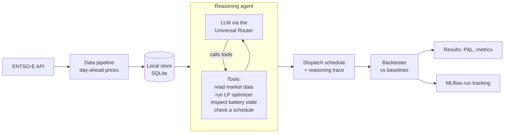
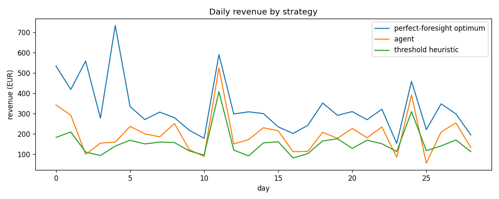

# Volta

An agent that trades a grid battery on the day-ahead electricity market. It reads European day-ahead prices, decides when to charge and discharge to earn money on the daily price spread, and gets scored against the best a perfect forecast could have done.

Volta keeps the language model out of the arithmetic. Picking the profit-maximizing schedule for a known price curve is a solved optimization problem, so the model does not choose megawatts directly. It handles the part where judgment helps, reading the day and deciding whether and how hard to trade, and it calls a linear-program optimizer as a tool for the math.

## The problem it solves

Electricity prices change every hour. On the European day-ahead market the price for each of tomorrow's 24 hours is fixed the afternoon before, and the daily swing is large: power is cheap overnight when demand is low and expensive in the early evening when it peaks. In Germany that gap is often around 30 EUR per megawatt-hour at night against 90 or more in the evening.

A grid-connected battery can earn money from that swing by charging when power is cheap and discharging when it is dear. The catch is that a battery has physical limits. It holds a fixed amount of energy, it can only charge or discharge so fast, it loses a little energy on every round trip, and it should not sit fully empty or fully full. So "buy low, sell high" turns into a constrained scheduling problem: across the 24 hours, decide how much to charge or discharge each hour to make the most money without breaking any of those limits. Volta makes that decision day by day and then measures how good the decisions were.

## What it's for

Volta shows one way to put a language model to work in a quantitative domain without trusting it with the math. The model handles judgment and orchestration, the arithmetic goes to a real solver, and every run is graded against a hard upper bound so the numbers cannot flatter themselves. It also works as a scaffold for testing trading ideas safely. Swap in a better forecaster or a different decision policy and the backtester tells you whether it actually made more money, with no real battery and no real money at stake.

## How it works



For each day the agent gets a price forecast (it only ever sees past days, never the day it is planning), reads the battery state, and calls the optimizer. It then commits a schedule or decides to hold. The backtester replays history and scores three references against the agent on the prices that actually occurred: doing nothing, a naive price-rank heuristic that plans on the same forecast the agent sees, and the perfect-foresight optimum that a flawless forecast would have captured. The earliest day has no prior day to forecast from, so it is skipped rather than scored as a forced, information-free hold.

The agent plans against a forecast, the same handicap a real trader has, while the optimum is scored on the prices that really arrived. The gap between them is the cost of not knowing the future, and the agent's headline number is the share of that optimum it captured. The heuristic plans on the same forecast, so beating it means the agent's allocation beats a naive price-rank rule on equal information, and the longer-term goal is to close the gap to the optimum.

## Components

- **Data pipeline** (`market/pipeline.py`): pulls DE-LU day-ahead prices from the ENTSO-E Transparency Platform into SQLite (`market/storage.py`). Ships with a deterministic synthetic generator so the whole system runs offline before you have an API token.
- **Forecast** (`market/forecast.py`): the single seam for the price forecast the agent plans against. Today it is naive, the previous day's prices. The agent's tool and the backtester's baseline both read it, so a better forecaster is a one-place swap.
- **Inference layer** (`agent/llm.py`): the OpenAI SDK pointed at any OpenAI-compatible provider, chosen by an environment variable. Groq, OpenAI, Anthropic, Google, a local Ollama server, and the ScaDS.AI gateway all work without code changes.
- **Optimizer** (`optimize/optimizer.py`): a linear program (PuLP) that returns the revenue-maximizing charge and discharge schedule for a price series, respecting capacity, power, efficiency, and state-of-charge limits. A binary per-hour mode variable stops the battery from charging and discharging in the same hour, which keeps schedules physical even when prices go negative.
- **Agent** (`agent/agent.py`): a plain Python ReAct loop with no framework. It calls the tools, reasons, and ends on a single decision line.
- **Backtester** (`eval/backtester.py`): replays days with no lookahead, scores only the days a forecast exists for, feeds the baseline the same forecast the agent sees, and logs each run to MLflow.

## Project layout

```
src/volta/
  config.py        battery model and project constants
  market/          SQLite storage, the ENTSO-E and synthetic pipelines, the forecast seam
  optimize/        the LP optimizer, the SOC simulator, and baseline strategies
  agent/           the ReAct loop, its tools, the prompts, and the LLM client
  eval/            the backtester and the report writer
  __main__.py      the CLI, run as python -m volta
tests/             one module per component, no API key needed
```

## Results

These are on 29 scorable days of synthetic day-ahead prices with realistic day-to-day variation, so yesterday's curve is only a rough guide to today's. The earliest day has no prior day to forecast from and is skipped. Real DE-LU numbers will replace these once the ENTSO-E API token is in hand.

| Strategy | Total revenue (EUR) | Share of optimum |
| --- | --- | --- |
| Perfect-foresight optimum | 9,514 | 100% |
| Agent (LP on the naive forecast) | 5,815 | 61.1% |
| Threshold heuristic | 4,464 | 46.9% |
| Do nothing | 0 | 0% |



The optimum and the two baselines need no model and are computed directly. The threshold heuristic plans on the same forecast the agent sees rather than peeking at realized prices. That makes it a fair bar, and it is why it sits at 46.9% instead of the higher number a price-foresight version would post. The agent runs the optimizer on that same forecast and reaches 61.1%, well clear of the heuristic. The rest of the gap is forecast error, and a better forecaster dropped in where the naive one sits is what closes it. The baselines here are reproducible offline; the agent figure is from a keyed backtest run over the same 29 days.

## Running it

Python 3.10 or newer.

```bash
python -m venv .venv
.venv/bin/pip install -e ".[dev]"
```

This installs Volta as an editable package, so `python -m volta` and `import volta` work from anywhere.

Use the `run.sh` wrapper. Load data first (the synthetic loader needs no key and runs offline), then backtest:

```bash
./run.sh sample                                       # 60 synthetic days, offline
LLM_PROVIDER=groq GROQ_API_KEY=your-key ./run.sh backtest
LLM_PROVIDER=groq GROQ_API_KEY=your-key ./run.sh today 2025-01-15
```

For real prices, request a free ENTSO-E token (see below) and fetch:

```bash
ENTSOE_API_TOKEN=your-token ./run.sh fetch 2025-01-01 2025-04-01
```

`run.sh` just wraps `python -m volta`, so you can call the CLI directly if you prefer.

Keys are read from the environment and from nowhere else. There is no `.env` file and no on-disk secret. Pass a key on the same line so it stays in that one process. If you keep keys in a secret manager, fetch at run time, for example with Bitwarden:

```bash
SCADS_API_KEY="$(bw get password SCADS.AI --session "$(bw unlock --raw)")" \
  LLM_PROVIDER=scads .venv/bin/python -m volta backtest
```

Pick any provider with `LLM_PROVIDER` (`groq`, `openai`, `anthropic`, `google`, `scads`, `ollama`) or point `LLM_BASE_URL` at any other OpenAI-compatible endpoint. The model needs to support tool calling.

The ENTSO-E token is free: register on the Transparency Platform, then email transparency@entsoe.eu to have API access enabled on your account. Pass it as `ENTSOE_API_TOKEN`.

## What is real and what is simplified

Real: the market structure (DE-LU hourly day-ahead), the optimization, the no-lookahead backtest, the agent loop and its tools.

Simplified, on purpose: the forecast is naive (it reuses the previous day's prices rather than a learned model), the battery is a config-driven model rather than real hardware, and only the day-ahead market is covered, not intraday or balancing. There is no live trading.

Next steps: a learned price forecaster, then calibrated uncertainty on top of it. The forecast is the single seam in `market/forecast.py`, so a learned model drops in where the naive one is now. The first move would be a regularized linear model (LEAR) or gradient-boosted trees, trained on price lags, calendar features, and load and renewable forecasts. On real data those load and renewable forecasts matter more than the price history.

After that, conformal prediction adapted for time series (adaptive conformal inference, ensemble batch prediction intervals) can wrap that model to give calibrated prediction intervals that survive the distribution shift plain conformal prediction does not handle. The agent could then act on uncertainty: cycle hard when the spread is confidently large, and hold or trade lightly when the day is uncertain. Using it fully means moving the optimizer from a single point forecast toward stochastic or robust optimization over scenarios. Each step is measured the same way, by how much of the perfect-foresight optimum it captures.

## Tests

```bash
.venv/bin/pytest
```

The optimizer is checked against hand-computed arbitrage cases, the agent loop runs against a scripted fake client so the tests need no API key, and the backtester's scoring is verified end to end on synthetic data.
