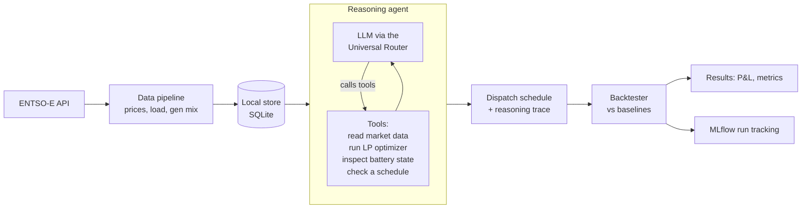

# Volta

An agent that trades a grid battery on the day-ahead electricity market. It reads real European prices, decides when to charge and discharge to earn money on the daily price spread, and gets scored against the best a perfect forecast could have done.

Volta keeps the language model out of the arithmetic. Picking the profit-maximizing schedule for a known price curve is a solved optimization problem, so the model does not choose megawatts directly. It handles the part where judgment helps, reading the day and deciding whether and how hard to trade, and it calls a linear-program optimizer as a tool for the math.

## How it works



For each day the agent gets a price forecast (it only ever sees past days, never the day it is planning), reads the battery state, and calls the optimizer. It then commits a schedule or decides to hold. The backtester replays history, scores the agent's schedule on the prices that actually occurred, and compares it to three references: doing nothing, a naive price-rank heuristic, and the perfect-foresight optimum that a flawless forecast would have captured.

## Components

- **Data pipeline** (`pipeline.py`): pulls DE-LU day-ahead prices from the ENTSO-E Transparency Platform into SQLite. Ships with a deterministic synthetic generator so the whole system runs offline before you have an API token.
- **Inference layer** (`llm.py`): the OpenAI SDK pointed at any OpenAI-compatible provider, chosen by an environment variable. Groq, OpenAI, Anthropic, Google, a local Ollama server, and the ScaDS.AI gateway all work without code changes.
- **Optimizer** (`optimizer.py`): a linear program (PuLP) that returns the revenue-maximizing charge and discharge schedule for a price series, respecting capacity, power, efficiency, and state-of-charge limits. A binary per-hour mode variable stops the battery from charging and discharging in the same hour, which keeps schedules physical even when prices go negative.
- **Agent** (`agent.py`): a plain Python ReAct loop with no framework. It calls the tools, reasons, and ends on a single decision line.
- **Backtester** (`backtester.py`): replays days with no lookahead, scores every strategy on realized prices, and logs each run to MLflow.

## Results

These are on 60 days of synthetic data with a realistic daily price shape. Real DE-LU numbers will replace them once the ENTSO-E API token is in hand.

| Strategy | Revenue (EUR, 60 days) | Share of optimum |
| --- | --- | --- |
| Perfect-foresight optimum | 27,075 | 100% |
| Naive price-rank heuristic | 14,799 | 54.7% |
| Do nothing | 0 | 0% |

The optimum and baselines need no model and are computed directly. The agent's own figure comes from a backtest run with an LLM key (see below); it slots into this table as the row to beat the heuristic and approach the optimum.

## Running it

Python 3.10 or newer.

```bash
python -m venv .venv
.venv/bin/pip install -r requirements.txt
```

Load data, then backtest. The synthetic loader needs no key and no network:

```bash
.venv/bin/python main.py sample --start 2025-01-01 --days 60     # synthetic, offline
.venv/bin/python main.py fetch  --start 2025-01-01 --end 2025-04-01   # real DE-LU, needs ENTSOE_API_TOKEN
```

```bash
LLM_PROVIDER=groq GROQ_API_KEY=your-key .venv/bin/python main.py backtest
LLM_PROVIDER=groq GROQ_API_KEY=your-key .venv/bin/python main.py today --date 2025-01-15
```

Keys are read from the environment and from nowhere else. There is no `.env` file and no on-disk secret. Pass a key on the same line so it stays in that one process. If you keep keys in a secret manager, fetch at run time, for example with Bitwarden:

```bash
SCADS_API_KEY="$(bw get password SCADS.AI --session "$(bw unlock --raw)")" \
  LLM_PROVIDER=scads .venv/bin/python main.py backtest
```

Pick any provider with `LLM_PROVIDER` (`groq`, `openai`, `anthropic`, `google`, `scads`, `ollama`) or point `LLM_BASE_URL` at any other OpenAI-compatible endpoint. The model needs to support tool calling.

The ENTSO-E token is free: register on the Transparency Platform, then email transparency@entsoe.eu to have API access enabled on your account. Pass it as `ENTSOE_API_TOKEN`.

## What is real and what is simplified

Real: the market structure (DE-LU hourly day-ahead), the optimization, the no-lookahead backtest, the agent loop and its tools.

Simplified, on purpose: the forecast is naive (it uses a recent comparable day rather than a learned model), the battery is a config-driven model rather than real hardware, and only the day-ahead market is covered, not intraday or balancing. There is no live trading.

Next step: a learned price forecaster. The agent and backtest are built so a better forecast drops in where the naive one is now, and the gap to the perfect-foresight optimum is the room a better forecast has to earn.

## Tests

```bash
.venv/bin/pytest
```

The optimizer is checked against hand-computed arbitrage cases, the agent loop runs against a scripted fake client so the tests need no API key, and the backtester's scoring is verified end to end on synthetic data.
